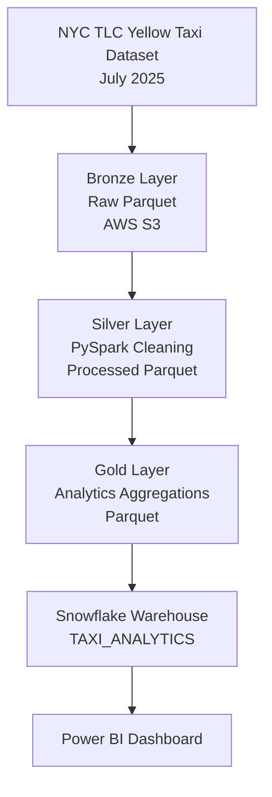
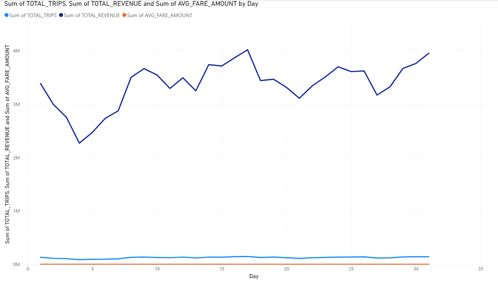

# Batch ELT Pipeline

## Project Overview

This project builds an end-to-end batch ELT pipeline using NYC TLC Yellow Taxi trip data.

The goal is to simulate a real-world data engineering workflow by ingesting raw data, transforming it into analytics-ready datasets, orchestrating the pipeline, and loading curated data into a cloud data warehouse.

Completed:
- Automated data ingestion using Python
- Stored raw data in AWS S3 Bronze layer
- Provisioned AWS infrastructure using Terraform
- Built PySpark Bronze → Silver → Gold transformation pipelines
- Added data quality validation checks
- Orchestrated the pipeline using Apache Airflow
- Loaded Gold analytics tables into Snowflake


## Architecture



## Technology Stack

| Technology | Purpose |
| ---------- | ------- |
| Python | Data ingestion and automation |
| AWS S3 | Data lake storage |
| Terraform | Infrastructure as Code |
| boto3 | AWS data uploads |
| PySpark | Data transformation |
| Apache Airflow | Pipeline orchestration |
| Snowflake | Cloud data warehouse |
| Power BI | Analytics visualization |

```markdown
## Infrastructure

Cloud infrastructure is managed using Terraform to make the pipeline reproducible and version controlled.

Architecture:

```

AWS S3
├── Bronze Layer
│   └── Raw taxi data
│
├── Silver Layer
│   └── Cleaned Parquet data
│
└── Gold Layer
└── Analytics-ready datasets

Terraform
└── Provisions and manages AWS resources

Snowflake
└── Analytics warehouse for Gold tables

```

Terraform allows the required cloud resources to be recreated without manual configuration.
```

## Project Structure

```
batch-elt-pipeline/

├── ingestion/
│   ├── download_taxi_data.py
│   └── upload_to_s3.py
├── transform/
│   ├── bronze_to_silver.py
│   └── silver_to_gold.py
├── validation/
│   └── validate_gold.py
├── snowflake/
│   ├── load_gold.py
│   └── load_gold.sql
├── dags/
│   └── taxi_pipeline_dag.py
├── terraform/
├── data/
├── docs/
├── requirements.txt
└── README.md
```


# Data Layers

## Bronze Layer

Raw NYC Taxi trip data stored as immutable Parquet files in AWS S3.

Purpose:
- Preserve original source data
- Provide a reliable source for downstream transformations


## Silver Layer

Cleaned and standardized trip-level data created using PySpark.

Transformations:
- Removed duplicate records
- Removed invalid trip timestamps
- Standardized column formats
- Preserved valid financial adjustments
- Added analytical features:

  - trip duration
  - average speed
  - pickup hour
  - day of week
  - weekend indicator
  - trip distance category


Results:

```
Bronze rows: 3,898,963
Silver rows: 3,898,961
Rows removed: 2
```


## Gold Layer

Analytics-ready datasets optimized for reporting.

Created tables:

### Daily Trip Summary

Tracks daily taxi activity and revenue trends.

Columns include:
- date
- total trips
- average distance
- average duration
- average fare
- total revenue


### Hourly Demand

Analyzes demand patterns throughout the day.

Columns include:
- pickup hour
- total trips
- average fare
- average distance
- weekend indicator


### Location Metrics

Provides pickup zone performance metrics.

Columns include:
- pickup location ID
- total trips
- revenue
- average fare
- average tip percentage


Gold data is stored as Parquet files and loaded into Snowflake for analytics.


# Data Quality Checks

Before transformation, the Bronze dataset was profiled using PySpark.

Checks performed:

### Null Analysis

Identified missing values in columns such as:
- passenger_count
- RatecodeID
- store_and_fwd_flag
- congestion_surcharge
- Airport_fee


### Negative Value Analysis

Checked financial columns:

- trip_distance
- fare_amount
- tip_amount
- total_amount

Negative values were investigated and preserved when representing valid financial adjustments such as refunds.


### Duplicate Detection

```
Total rows:      3,898,963
Distinct rows:   3,898,962
Duplicates:      1
```

The duplicate record was removed during Silver transformation.


### Timestamp Validation

Invalid trips where:

```
dropoff_time < pickup_time
```

were removed during transformation.


# Pipeline Orchestration

Apache Airflow manages the execution order, scheduling, retries, and monitoring of the ELT workflow.

Pipeline:

```
Dataset Download
        |
        v
Bronze S3 Upload
        |
        v
Bronze → Silver Transformation
        |
        v
Silver → Gold Aggregation
        |
        v
Data Quality Validation
        |
        v
Snowflake Load
```

Airflow features:
- Task dependencies
- Automatic retries
- Logging
- Failure handling


# Snowflake Warehouse

Gold analytics tables are loaded into Snowflake.

Database:

```
TAXI_ANALYTICS
```

Schema:

```
GOLD
```

Tables:

```
GOLD.DAILY_TRIP_SUMMARY
GOLD.HOURLY_DEMAND
GOLD.LOCATION_METRICS
```

Snowflake serves as the analytics layer for downstream reporting tools.


# Running the Pipeline

## Install Dependencies

```bash
pip install -r requirements.txt
```

## Start Airflow

```bash
docker compose up
```

Open Airflow UI and trigger:

```
taxi_pipeline
```

The DAG executes:

```
download
   ↓
upload_bronze
   ↓
bronze_to_silver
   ↓
silver_to_gold
   ↓
validate_gold
   ↓
load_to_snowflake
```
## CI/CD

GitHub Actions automatically validates code changes on every push and pull request.

The CI pipeline performs:

- Installing project dependencies
- Running automated tests with pytest
- Checking code quality using flake8

Workflow:

```

Code Change
|
v
GitHub Actions
|
v
Install Dependencies
|
v
Run Tests
|
v
Run Linting
|
v
Pipeline Validation Complete

```

This helps catch transformation errors and maintain consistent code quality before changes are merged.

## Cleaning Up Cloud Resources

To remove AWS resources created by Terraform:

```bash
terraform destroy
```

This destroys provisioned infrastructure and prevents unnecessary cloud costs from unused resources.

# Dashboard

The Gold layer tables are visualized using Power BI.

The dashboard provides insights into:

- Daily taxi demand trends
- Revenue patterns
- Peak pickup hours
- Top pickup locations

Screenshots:



# Future Improvements

Potential improvements:

- Add automated data quality monitoring using Great Expectations
- Add AWS Glue Catalog for metadata management
- Deploy Airflow using managed services such as MWAA
- Add incremental loading instead of full batch processing
- Add CI/CD deployment pipelines for production environments
- Add dashboard refresh automation

```
