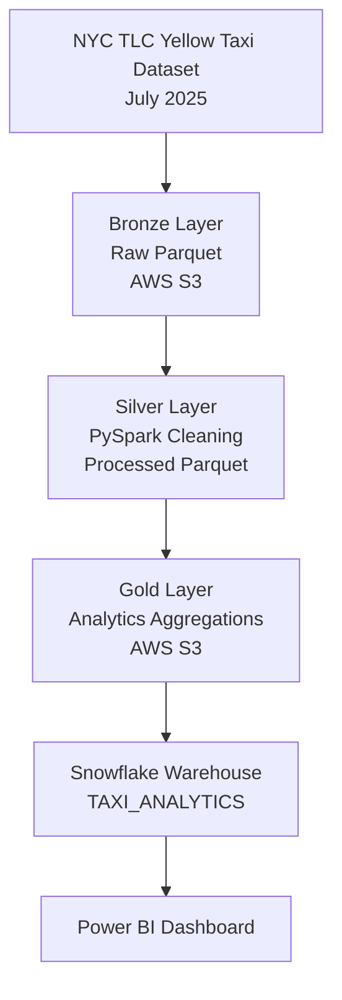

# Batch ELT Pipeline

## Project Overview

This project builds an end-to-end batch ELT pipeline using NYC TLC Yellow Taxi trip data.

The goal is to simulate a real-world data engineering workflow by ingesting raw data, storing it in a cloud data lake, transforming it into analytics-ready datasets, and visualizing insights.

Current progress:
- Automated data ingestion using Python
- Stored raw data in AWS S3 Bronze layer
- Provisioned AWS infrastructure using Terraform
- Configured PySpark environment
- Profiled Bronze dataset using Spark DataFrames
- Built Bronze → Silver transformation pipeline
- Cleaned and validated Silver dataset using PySpark

Planned:
- Snowflake warehouse integration
- Airflow orchestration
- Power BI dashboard


## Architecture



## Technology Stack

| Technology | Purpose                          |
| ---------- | -------------------------------- |
| Python     | Data ingestion                   |
| AWS S3     | Raw data storage                 |
| Terraform  | Infrastructure as Code           |
| boto3      | Upload data to S3                |
| PySpark    | Data cleaning and transformation |
| Snowflake  | Analytics data warehouse         |
| Airflow    | Pipeline orchestration (planned) |
| Power BI   | Analytics visualization (planned)|

## Project Structure

```
batch-elt-pipeline/

├── ingestion/
│   ├── download_taxi_data.py
│   └── upload_to_s3.py
├── terraform/
├── data/
├── notebooks/
├── docs/
├── requirements.txt
└── README.md
```

# Running the Ingestion Pipeline

## Install Dependencies

```bash
pip install -r requirements.txt
```

## Download Dataset

```bash
python ingestion/download_taxi_data.py
```

Saves data locally:

```
data/raw/yellow_tripdata_2025-07.parquet
```

## Upload to S3

```bash
python ingestion/upload_to_s3.py
```

Stored in:

```
bronze/
└── yellow/
    └── year=2025/
        └── month=07/
            └── yellow_tripdata_2025-07.parquet
```

# AWS Setup

Configure AWS credentials:

```bash
aws configure
```

The ingestion script uses boto3 to authenticate and upload data to S3.

# Terraform Setup

Navigate to the Terraform folder:

```bash
cd terraform
```

Initialize:

```bash
terraform init
```

Preview changes:

```bash
terraform plan
```

Create resources:

```bash
terraform apply
```

# Data Layers

## Bronze

Raw immutable data stored in S3.

## Silver

Cleaned and transformed data using PySpark.

## Gold

Analytics-ready tables used for reporting and dashboards.


# Data Profiling & Quality Checks

Before building the Silver transformation layer, the Bronze dataset was analyzed using PySpark to understand data quality issues and define transformation rules.

Dataset profiled:

- NYC TLC Yellow Taxi Trip Data
- July 2025
- 3,898,963 total records

## Null Analysis

The following columns contained missing values:

| Column | Null Count |
| ------ | ----------: |
| passenger_count | 1,038,755 |
| RatecodeID | 1,038,755 |
| store_and_fwd_flag | 1,038,755 |
| congestion_surcharge | 1,038,755 |
| Airport_fee | 1,038,755 |

Null handling decisions will be made based on business meaning rather than removing all incomplete records.

Examples:

- `Airport_fee` null values may indicate the fee was not applicable.
- `passenger_count` null values represent missing trip attributes and will be documented rather than blindly removed.

## Data Quality Checks

### Negative Value Checks

Checked columns:

- `trip_distance`
- `fare_amount`
- `tip_amount`
- `total_amount`

Results:

| Column | Negative Values |
| ------ | --------------: |
| trip_distance | 0 |
| fare_amount | 247,088 |
| tip_amount | 122 |
| total_amount | 76,455 |

Negative financial values were investigated before removal.

Analysis showed that negative fares were associated with negative total amounts and zero tips, suggesting these records represent refunds or transaction adjustments rather than corrupted data.

Decision:

- Preserve negative financial transactions in the Silver layer.
- Allow downstream analytics tables to filter based on business requirements.

## Duplicate Analysis

Checked for exact duplicate records.

Results:

```

Total rows:      3,898,963
Distinct rows:   3,898,962
Duplicates:      1

```

Decision:

- Remove exact duplicate records during Silver transformation.

## Timestamp Validation

Checked for trips where:

```

dropoff_time < pickup_time

```

Results:

```

Invalid timestamp records: 1

```

Decision:

- Remove records with impossible trip durations during Silver transformation.

## Silver Layer Transformation Rules

The Bronze → Silver transformation:

- Removes exact duplicate records
- Removes impossible timestamp records
- Preserves legitimate refund/adjustment transactions
- Renames inconsistent columns
- Standardizes data formats
- Maintains raw Bronze data unchanged
- Adds derived analytical columns:
  - trip duration
  - average speed
  - pickup hour
  - pickup day of week
  - weekend indicator
  - trip distance category
```
# Bronze → Silver Transformation

The Silver layer converts raw Bronze data into a cleaned and analytics-ready dataset using PySpark.

## Cleaning Steps Performed

The transformation pipeline:

- Removed exact duplicate records
- Removed invalid trips where dropoff time occurred before pickup time
- Preserved valid financial adjustment records (negative fares/refunds)
- Renamed inconsistent columns for readability
- Standardized timestamp and column formats

Results:
```
Bronze rows: 3,898,963
Silver rows: 3,898,961
Rows removed: 2
```


Removed records:
- 1 duplicate row
- 1 invalid timestamp record


## Derived Columns Added

The Silver dataset includes additional fields to support analytics:

| Column | Description |
| ------ | ----------- |
| trip_duration_minutes | Total trip time in minutes |
| average_speed_mph | Average trip speed |
| pickup_hour | Hour of day when trip started |
| pickup_day_of_week | Day of week when trip started |
| is_weekend | Indicates weekend trips |
| trip_distance_category | Categorizes trips by distance |

The Silver dataset is stored as partitioned Parquet files:
```
silver/
└── yellow/
└── year=2025/
└── month=07/
```

Parquet was chosen because it is optimized for analytical workloads and supports efficient column-based queries.
```

# Silver → Gold Transformation

The Gold layer contains analytics-ready tables created from the Silver dataset using PySpark aggregations.

Unlike the Silver layer, which stores cleaned trip-level records, the Gold layer contains business-focused metrics optimized for reporting and dashboarding.

## Gold Tables

### Daily Trip Summary

Answers:

> How does taxi demand and revenue change over time?

Schema:

| Column | Description |
| ------ | ----------- |
| date | Trip date |
| total_trips | Number of trips completed |
| avg_trip_distance | Average trip distance |
| avg_trip_duration_minutes | Average trip duration |
| avg_fare_amount | Average fare per trip |
| avg_tip_amount | Average tip amount |
| total_revenue | Total revenue generated |
| avg_speed_mph | Average trip speed |


### Hourly Demand

Answers:

> What times of day have the highest taxi activity?

Schema:

| Column | Description |
| ------ | ----------- |
| pickup_hour | Hour of day |
| total_trips | Number of trips |
| avg_fare | Average fare |
| avg_distance | Average trip distance |
| avg_duration | Average trip duration |
| weekend_flag | Weekend indicator |


### Location Metrics

Answers:

> Which pickup locations generate the most activity and revenue?

Schema:

| Column | Description |
| ------ | ----------- |
| pickup_location_id | Taxi zone identifier |
| total_trips | Number of trips |
| total_revenue | Revenue generated |
| avg_fare | Average fare |
| avg_tip_percentage | Average tip percentage |
| avg_trip_distance | Average trip distance |


Gold tables are stored as Parquet files:

```

gold/
├── daily_trip_summary/
├── hourly_demand/
└── location_metrics/

```

These tables are optimized for analytics workloads and serve as the source layer for Snowflake and Power BI reporting.
```

## Snowflake Warehouse

Gold analytics tables are loaded into Snowflake for querying and visualization.

Database:

```

TAXI_ANALYTICS

```

Schemas:

```

GOLD
STAGING

```

Gold Tables:

```

GOLD.DAILY_TRIP_SUMMARY
GOLD.HOURLY_DEMAND
GOLD.LOCATION_METRICS

```

The Snowflake warehouse acts as the serving layer for downstream analytics tools such as Power BI.
```
